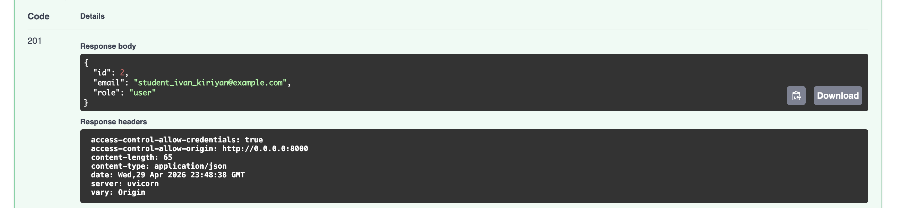
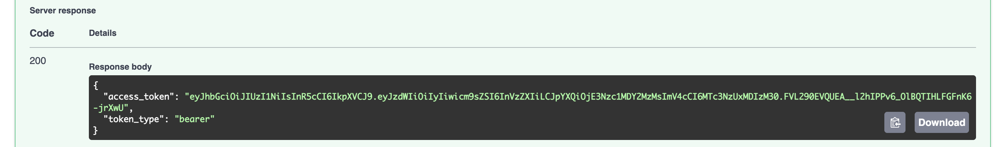
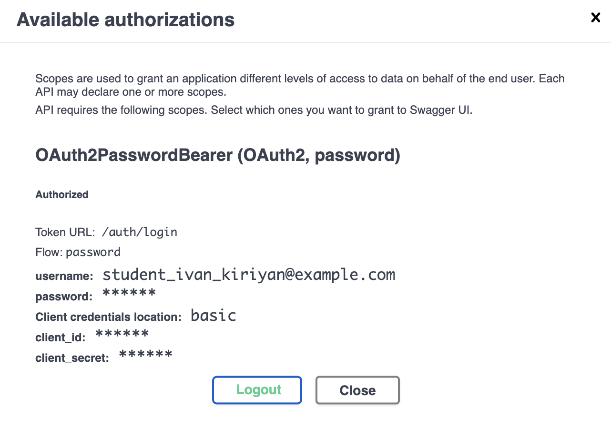
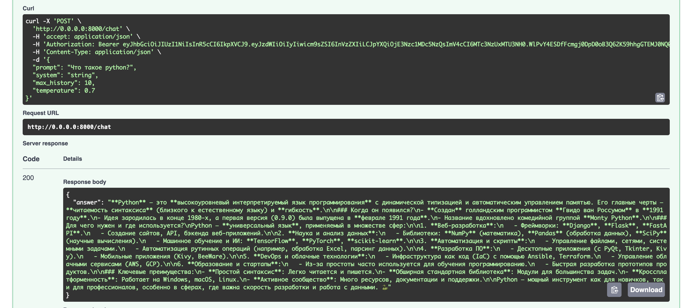
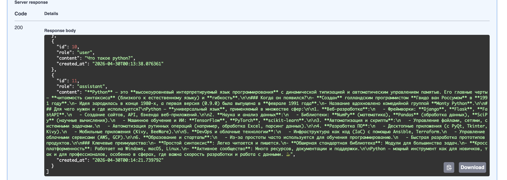
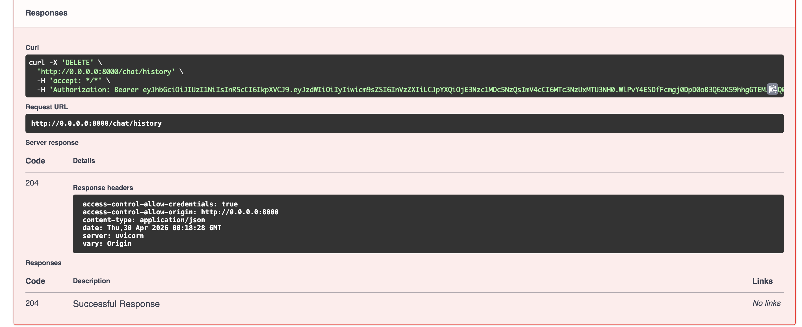
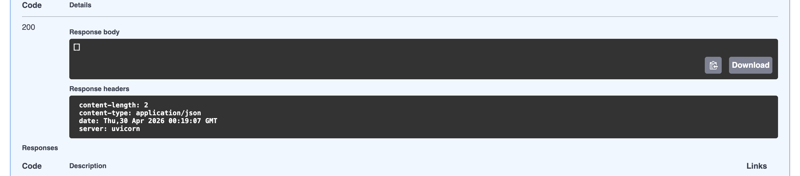

# LLM-P | Принципы разработки на языке Python | Выполнил: студент группы М25-555 Иван Кириян

llm-p -- серверное приложение на FastAPI, предоставляющего защищённый API для взаимодействия с большой языковой моделью (LLM) через сервис OpenRouter. Реализована аутентификация и авторизация пользователей с использованием JWT, хранение данных в базе SQLite.

Использованная модель: z-ai/glm-4.5-air:free

## Стек:
- Python 3.14.2
- FastAPI
- JWT
- SQLAlchemy
- httpx
- uv

## Как установить?

### 1. Установка uv

```bash
pip install uv
```

### 2. Клонирование репозитория

```bash
git clone https://github.com/IvanKiriyan/llm-p.git
cd llm-p
```

### 3. Создание и активация виртуального окружения

```bash
uv venv
source .venv/bin/activate  # MacOS/Linux
.venv\Scripts\activate.bat # Windows
```

### 4. Установка зависимости проекта

```bash
uv pip install -r <(uv pip compile pyproject.toml)
```

### 5. Настройка переменных окружения

Скопировать `.env.example` в `.env`:

```bash
cp .env.example .env
```

Вставить API-ключ OpenRouter в `.env`:

### 6. Запуск приложения

```bash
uv run uvicorn app.main:app --reload --host 0.0.0.0 --port 8000
```

Swagger UI доступен по адресу: http://0.0.0.0:8000/docs

## Демонстрация работы эндпоинтов

### 1. Регистрация пользователя — POST /auth/register



### 2. Логин и получение JWT — POST /auth/login



### 3. Авторизация в Swagger



### 4. Запрос к LLM — POST /chat



### 5. История диалога — GET /chat/history



### 6. Удаление истории — DELETE /chat/history



### 7. Проверка, что история была удалена — GET /chat/history




## Структура проекта:
```llm_p/
├── pyproject.toml                 # Зависимости проекта (uv)
├── README.md                      # Описание проекта и запуск
├── .env.example                   # Пример переменных окружения
│
├── app/
│   ├── init.py
│   ├── main.py                    # Точка входа FastAPI
│   │
│   ├── core/                      # Общие компоненты и инфраструктура
│   │   ├── init.py
│   │   ├── config.py              # Конфигурация приложения (env → Settings)
│   │   ├── security.py            # JWT, хеширование паролей
│   │   └── errors.py              # Доменные исключения
│   │
│   ├── db/                        # Слой работы с БД
│   │   ├── init.py
│   │   ├── base.py                # DeclarativeBase
│   │   ├── session.py             # Async engine и sessionmaker
│   │   └── models.py              # ORM-модели (User, ChatMessage)
│   │
│   ├── schemas/                   # Pydantic-схемы (вход/выход API)
│   │   ├── init.py
│   │   ├── auth.py                # Регистрация, логин, токены
│   │   ├── user.py                # Публичная модель пользователя
│   │   └── chat.py                # Запросы и ответы LLM
│   │
│   ├── repositories/              # Репозитории (ТОЛЬКО SQL/ORM)
│   │   ├── init.py
│   │   ├── users.py               # Доступ к таблице users
│   │   └── chat_messages.py       # Доступ к истории чатов
│   │
│   ├── services/                  # Внешние сервисы
│   │   ├── init.py
│   │   └── openrouter_client.py   # Клиент OpenRouter / LLM
│   │
│   ├── usecases/                  # Бизнес-логика приложения
│   │   ├── init.py
│   │   ├── auth.py                # Регистрация, логин, профиль
│   │   └── chat.py                # Логика общения с LLM
│   │
│   └── api/                       # HTTP-слой (тонкие эндпоинты)
│       ├── init.py
│       ├── deps.py                # Dependency Injection
│       ├── routes_auth.py         # /auth/*
│       └── routes_chat.py         # /chat/*
│
└── app.db                         # SQLite база (создаётся при запуске)
```